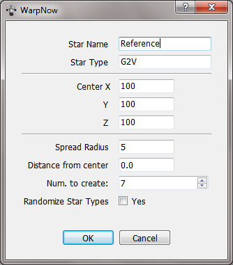

# Create fictional solar systems for Celestia using WarpNow!

Creating star sector, jumpmaps and solar systems is all well and good, but eventually you will get bored of it. What if we could _visualize_ our newly-created solar systems in some tridimensional way? Enter [Celestia](https://celestia.space), a nifty 3d-solar system simulator that can be expanded to no end with external data files and textures.

Incidentally, Warp **can** export its system data in a Celestia-friendly format and can generate textures according to planetary types (well, sort of: planetgen routines still can't generate proper craters, but still...)

This tutorial is a walkthrough that ends with a tour among your creations using Celestia. 

Small caveat: some text is in Italian, so bear with me. Moreover, while the underlying system is an ageing Windows 7, you can rest assured that the same workaround applies to Linux, too. 

After that, please follow me...

## Creating solar systems

First of all, launch **WarpNow!** and gaze into the stellar void :-) 

We have to create some stellar systems. We _could_ create a new sector, but the Celestia export function would a) last forever and b) fill your hard disk with countless textures. Instead, we elect to generate a small cluster of 7 solar systems.

To do this, click on **Add New Star** on the menu or press the `Ctrl+M` hotkey.

Change _Star Name_ to Reference, set center coordinates on 100, 100, 100 (first star will be located there), set _Spread Radius_ to 5 (stars will be created within a 5ly radius sphere from the starting coordinates and lastly, uncheck _Randomize Star Types_. We want a small cluster of Sol-like stars.

Then press **Ok**

Here's your small cluster, complete with jumproutes.

Now enter in _Solar System mode_ by pressing  `Ctrl+Tab` or by clicking the second button on the toolbar from left. 

You will see our **Reference** system, among with six other companions. Names are randomly generated, so your star list might (nay, WILL!) differ from mine

Now we have to create planets for these system. Click on the menu and select **Solar System for All Stars** or press `Ctrl+L`.

Yay, planets! Systems harboring an inhabitable (or a marginally inhabitable) planet sport a different icon similar to a... garden planet (duh).

However, we might want a garden (or a marginally inhabitable) planet on every system. Fear not! For every star not harboring a garden world, follow this procedure:

1. Select the star on the list
2. Press `Ctrl+N` (or select **New Solar System** from the menu) until the orb icon left of the star name turns into a small garden world or a small earth world. 

When you're done adjusting solar systems, switch to  _Star Sector Mode_ by pressing  `Ctrl+Tab` or by cliking the first button on the toolbar from left. 

Before generating Celestia data, **save your sector** by clicking `Ctrl+S` or selecting the **Save sector** item from the menu. 

Make sure to choose the **Star Sector json file (\*.starj)** file type, because it allows us to export not only stars' data, but also planetary and jumpweb data. 

By default, **WarpNow!** saves data in `$HOME/.local/share/Warp2010_Data` if you're on Linux, `c:\users\<your username>\.local\share\Warp2010_Data` if you're on Windows 7 onwards.

After having saved our work, we're ready to create Celestia Data. Press `Ctrl+E` or select **Export Sector** from menu. Be sure to choose **Celestia STC files** file type.

Now sit down and wait. According to your processor's power and the number of stars, you will have to wait for some minutes (it takes about 2 minutes to generate textures for seven Sol-like systems on a 8-years old Xeon quad-core).

A green progress bar on the bottom-right of the main window will help you assess remaining time. Again, if you choose to populate a whole freakin' star sector, you might want to do your groceries.

When everything's over go to `$HOME/.local/share/Warp2010_Data` if you're on Linux, `c:\users\<your username>\.local\share\Warp2010_Data` if you're on Windows 7 onwards. You'll find a folder named after the file name you've chosen when exporting to Celestia.

Copy this folder to the Celestia Extras path.

* On Linux, it usually is on `/usr/share/celestia/extras` or `/usr/local/share/celestia/extras` . You might want to `chmod 666` this path and gain write permissions, since it usually belongs to root. 
* On Windows, it usually is `c:\program files\celestia\extras`. 

Now launch Celestia and navigate to _Reference_. Press `Return`, type `Reference`, then `Return` again and then `G`. You will _warp_ to _Reference_ :-) 

Celestia has a Solar system navigator that shows you in a tree-like window all planets of the selected solar system.

And now, here's a showcase.

This one is a _marginal_ planet -- it might harbor life, but it is somewhat unsuited for humans. 

Keep **WarpNow!** open, it might help you locate interesting worlds.

Here's a **glacier** world. Might be inhabitable in the tropics. 

Now here's a gas giant, complete with rings.

And here's a desert world orbiting it -- it's got an atmosphere but it's surely poisonous to us humans. Or it might be a volcanic, toxic world like [Gamilon](https://aliens.fandom.com/wiki/Gamilon_(planet))

Finally, here's a garden world. 

While these planets might look somewhat campy (think Space:1999) bear in mind that all texture are procedurally generated without any human intervention. So, download this stuff and use it for your Sci-fi background projects!